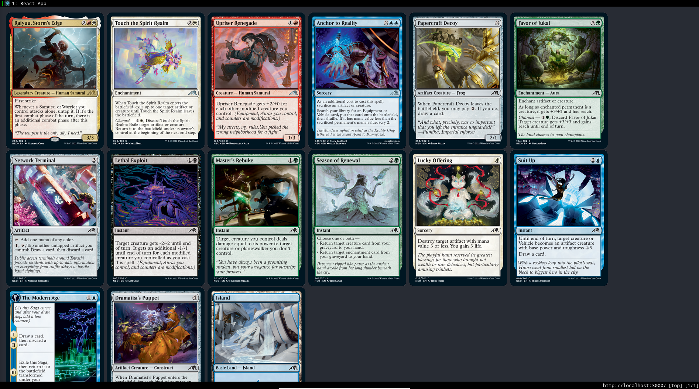

MTG Draft Simulator
===

Simulator for real-time, multi-user MTG drafting.

This project is [unofficial fan content](https://company.wizards.com/en/legal/fancontentpolicy). Magic: The Gathering and all card images © Wizards of the Coast.

### Running the project

Use `npm run dev` to run both the node server backend and the react client.

### Next steps

- [X] New pack generation through the backend / over HTTP
- [ ] Add timer for draft picks
- [ ] Automatically suggest then pick cards when timer is low
- [ ] "Smart" automatic picks (weight higher-value cards that fit chosen colors)
- [ ] Persist draft state between browser reloading
- [ ] Show chosen cards at bottom / side of page (swap between two?)
- [ ] Scale UI by window size
- [ ] Failure states + alert user on lost connection
- [ ] Milestone: single-user drafting
- [ ] Multi-user concurrent drafting
- [ ] Deckbuilding
- [ ] Store draft history
- [ ] Shareable links
- [ ] "Replay" draft history to show picks
